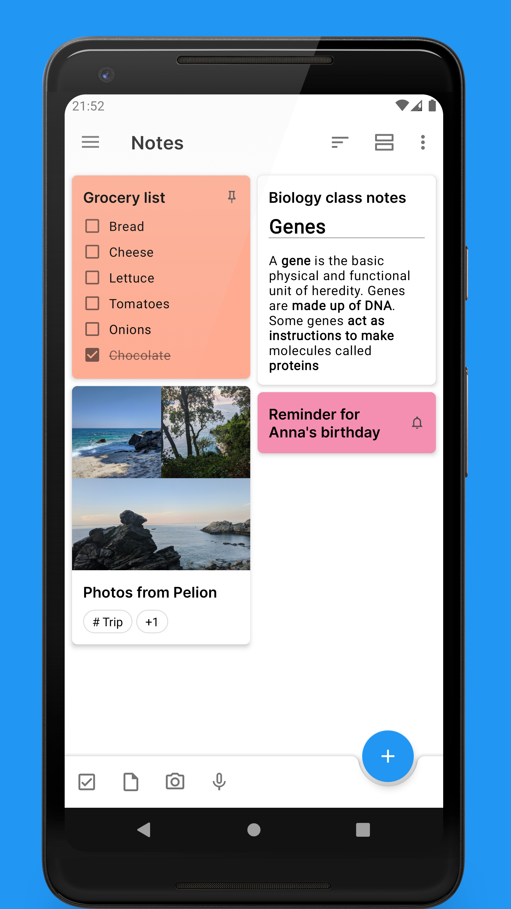
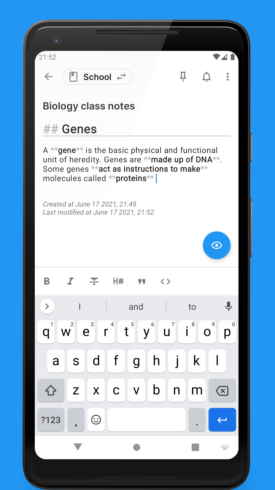
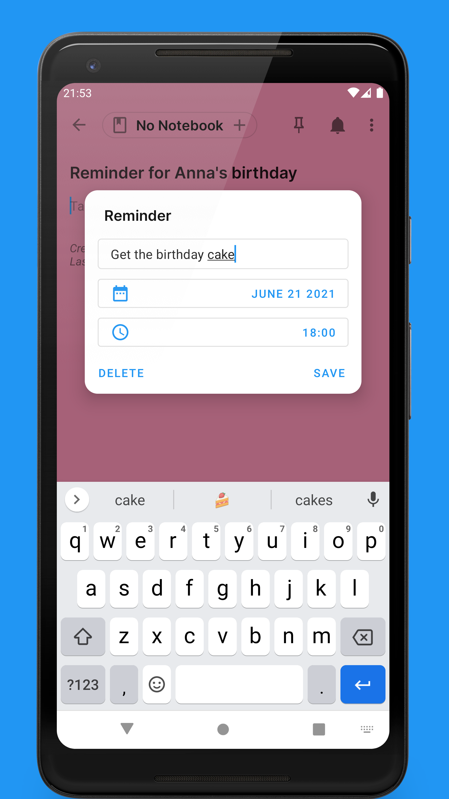

# Fork Notes
I will try to continue the project because i loved the app and i am using it.
I will try to find and merge all the merge requests that done by users either on the main project or at the forks of the project.

# Quillnote





Take beautiful markdown notes whenever you feel inspired. Place them in notebooks and tag them accordingly. Stay organized by making task lists, set reminders and keep everything in one place by attaching related files.

Quillnote is fully free and open-source. It will never show you ads, ask you for unnecessary permissions or upload your notes anywhere without you knowing.

<a href="https://f-droid.org/packages/org.qosp.notes">
    
</a>
<a href='https://play.google.com/store/apps/details?id=org.qosp.notes'></a>

## Features
With Quillnote, you can:

- Take notes with Markdown support
- Make task lists
- Pin your favorite notes to the top
- Hide notes you do not want others to see
- Set reminders for events you do not want to miss
- Add voice recordings and other file attachments
- Group related notes in notebooks
- Add tags to notes
- Archive notes you want out of your way
- Search through notes
- Sync with Nextcloud (experimental)
- Backup your notes to a zip file which you can restore at a later time
- Toggle between Light and Dark mode
- Choose between multiple color schemes

## License
```
Copyright (C) 2021 Michael Soultanidis

This program is free software: you can redistribute it and/or modify
it under the terms of the GNU General Public License as published by
the Free Software Foundation, either version 3 of the License, or
(at your option) any later version.

This program is distributed in the hope that it will be useful,
but WITHOUT ANY WARRANTY; without even the implied warranty of
MERCHANTABILITY or FITNESS FOR A PARTICULAR PURPOSE.  See the
GNU General Public License for more details.

You should have received a copy of the GNU General Public License
along with this program.  If not, see <https://www.gnu.org/licenses/>.
```
